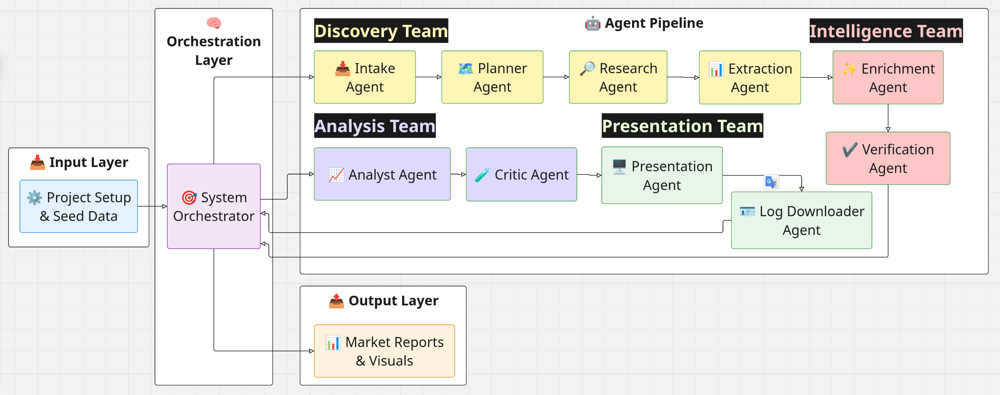

# Agentic Biotech Competitor Landscape

This project uses a team of AI agents to automatically research, analyze, and map the competitive landscape for AI companies in the biotech and drug discovery industry.



## What it does

It takes a list of drug development stages and turns it into a comprehensive market report. It doesn't just "search" the web; it thinks, verifies, and debates findings to give you a polished, critical view of the market.

## The AI Research Team

Instead of one complex program, we use specialized agents that work together like a real research department:

- **The Discovery Team**: These agents take your initial ideas, plan the search mission, and scour the web to find potential companies.
- **The Intelligence Team**: They perform a "deep dive" on every company found, gathering details like funding and headcount, and verifying that the company actually belongs in that specific market niche.
- **The Analysis Team**: One agent writes a detailed report based on the facts, while another acts as a "devil’s advocate" to challenge assumptions and identify missing information.
- **The Presentation Team**: Finally, an agent synthesizes everything into an investor-style memo and a slide outline, while another downloads company logos.

### How they synergize
The agents don't work in isolation. The **Discovery Team** passes leads to the **Intelligence Team**, who filter and enrich them. The **Analysis Team** then debates this refined data to ensure the final output isn't just a list of names, but a strategic evaluation of the landscape.

## Input & Output

### 📥 Input: The Search Map
- **Pipeline Stages**: A list of biotech categories you want to investigate (e.g., "Drug Discovery", "Clinical Trials").
- **Seed Companies (Optional)**: If you already know a few players, give them to the AI to jump-start the research.

### 📤 Output: The Market Intelligence
- **Competitor Matrix**: A clear table showing who is operating in which stage.
- **Company Dossiers**: Detailed profiles for every company identified.
- **Strategic Memo**: A written analysis of market "whitespaces" (unmet opportunities).
- **Presentation Deck**: A structured outline for your next slide deck, complete with company logos.

## Quick Start

1. **Setup your environment**:
   ```shell
   conda env create --file environment.yml
   conda activate agentic_ai_competitor_landscape
   ```
2. **Configure**: Add your `OPENAI_API_KEY` and `TAVILY_API_KEY` to your environment.
3. **Run**:
   ```shell
   python main.py
   ```

