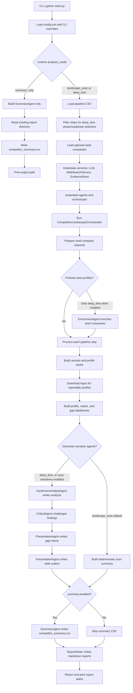
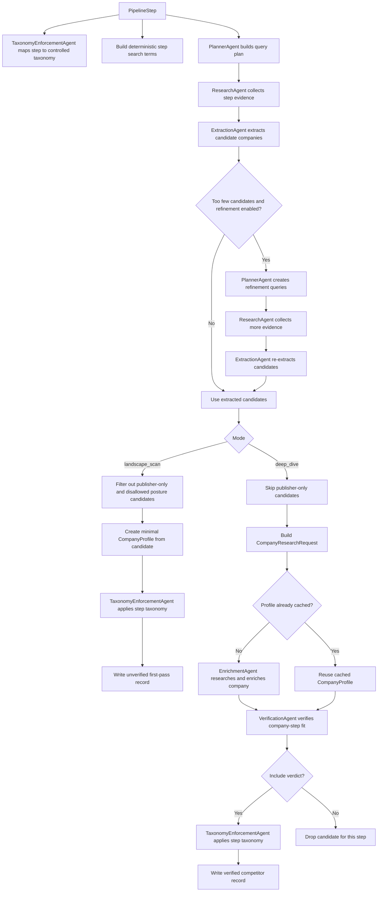

# Agent Workflow

This document describes how the agents are currently orchestrated by `main.py` and `lib/orchestrator.py`.

The workflow has three runtime modes:

- `landscape_scan`: cheaper first-pass discovery and lightweight reporting.
- `deep_dive`: full enrichment, verification, narrative analysis, and presentation outputs.
- `summary_only`: standalone summary CSV generation from an existing report directory.

## End-to-End Flow

## Per-Step Agent Flow

Each pipeline row is processed independently. The records from all rows are merged before reporting.

## Agent Responsibilities

| Agent | Role in the workflow |
| --- | --- |
| `UserCompanyIntakeAgent` | Converts optional seed-company CSV rows into research requests and step-specific seed candidates. |
| `TaxonomyEnforcementAgent` | Maps pipeline steps into the controlled taxonomy and applies that taxonomy to company profiles. |
| `PlannerAgent` | Builds the initial query plan for a pipeline step and creates refinement queries when too few candidates are found. |
| `ResearchAgent` | Executes web search and evidence collection through `WebSearchService` and the evidence store. |
| `ExtractionAgent` | Reads collected evidence and extracts candidate companies, products, posture labels, confidence, and source URLs. |
| `EnrichmentAgent` | In `deep_dive`, researches one company in detail and builds a richer `CompanyProfile`. |
| `VerificationAgent` | In `deep_dive`, decides whether a company actually belongs in the current pipeline step. |
| `FactDrivenAnalystAgent` | Produces evidence-led narrative analysis from the matrix, profile, and gap tables. |
| `CriticalAgent` | Reviews the analysis for weak assumptions, missing companies, and evidence gaps. |
| `PresentationAgent` | Generates the gap memo and presentation outline from the structured data and narrative review. |
| `SummaryAgent` | Writes `competitor_summary.csv` after a pipeline run or from an existing report directory in `summary_only` mode. |

## Mode Differences

| Step | `landscape_scan` | `deep_dive` | `summary_only` |
| --- | --- | --- | --- |
| Load pipeline CSV | Yes | Yes | No |
| Tavily/WebSearchService | Yes | Yes | No |
| Candidate extraction | Yes | Yes | No |
| Company enrichment | No | Yes | No |
| Company-step verification | No | Yes | No |
| Funding/headcount/HQ extraction | No | Yes | No |
| Fact-driven analysis | No by default | Yes | No |
| Critical review | No by default | Yes | No |
| Gap memo and slide outline | No by default | Yes | No |
| `competitor_summary.csv` | Yes when `summary.enabled` | Yes when `summary.enabled` | Yes |

## Output Assembly

After all steps finish, the orchestrator:

1. Selects reportable profiles from the profile cache.
2. Downloads or reuses company logos through `LogoDownloader`.
3. Builds `profile_df`, `matrix_df`, and `gap_df`.
4. Runs narrative agents only when the mode calls for them.
5. Runs `SummaryAgent` when `summary.enabled` is true.
6. Writes markdown reports through `ReportWriter`.
7. Returns the dataframes, narrative text, summary path, run context, and report paths to `main.py`.

